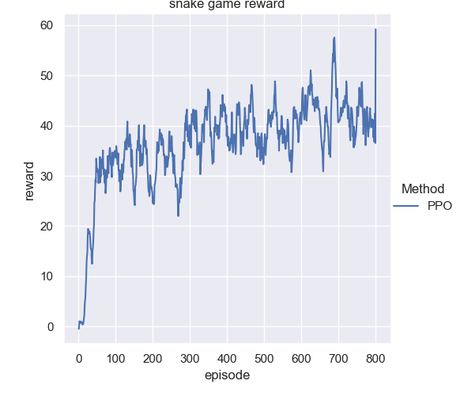
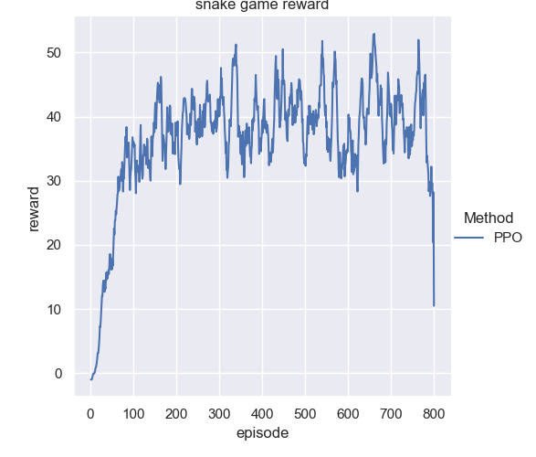
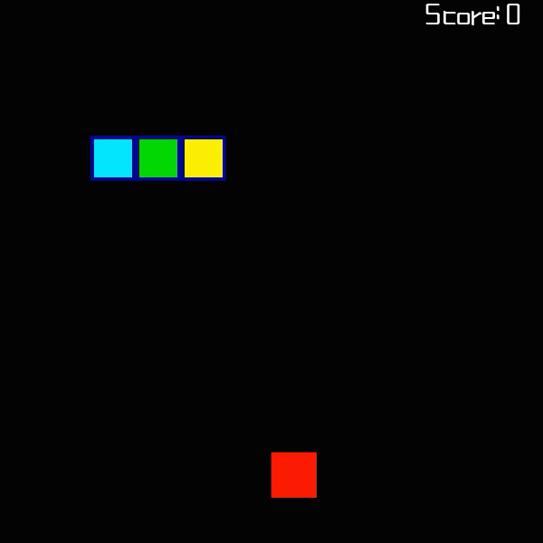
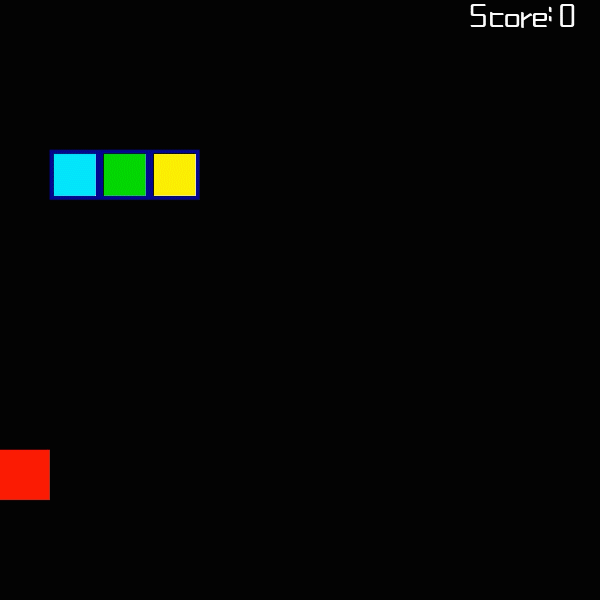
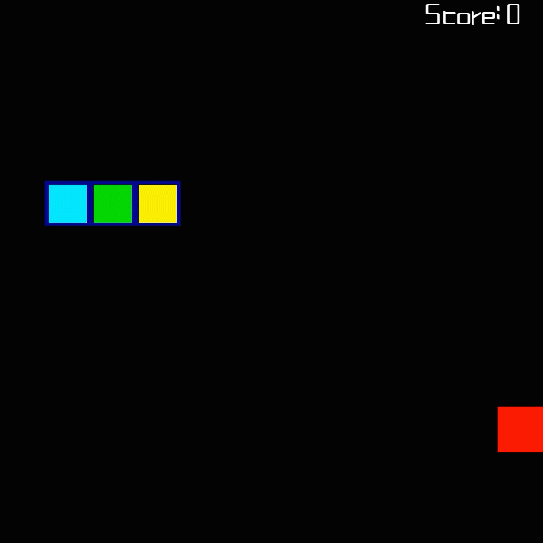

# PPO-Snake-AI

[](https://github.com/george-chou/PPO-Snake-AI/blob/master/LICENSE)

Using deep reinforcement learning to play Snake game.

The used algorithm is PPO for discrete! It has the brilliant performance in the field of discrete action space just like in continuous action space.

You just need half an hour to train the snake and then it can be as smart as you.

## Requirements

```
torch
numpy
seaborn
pygame
matplotlib
PIL
```

## Usage

Run _train.py_ to train, after training, the training curve of current round will autometically show;

Run _snake.py_ to evaluate latest saved model;

## Test

### Evaluate assigned model

```
python evaluate.py --weight ./model/act-weight_round2_614_86.5.pkl
```

### Plot assigned reward log

```
python plotter.py --history ./logs/reward_round3_82.5.csv
```

## Experiment

| Round        |                 1                  |                 2                  |                 3                  |
| :----------- | :--------------------------------: | :--------------------------------: | :--------------------------------: |
| Traing curve |  |  |  |
| Evaluation   |  |  |  |
| Reward_eat   |                +2.0                |                +2.0                |                +2.0                |
| Reward_hit   |                -0.5                |                -1.0                |                -1.5                |
| Reward_bit   |                -0.8                |                -1.5                |                -2.0                |

## Future work

The zigzag of snake body looks ugly, try to add punishment into reward for zigzag count.